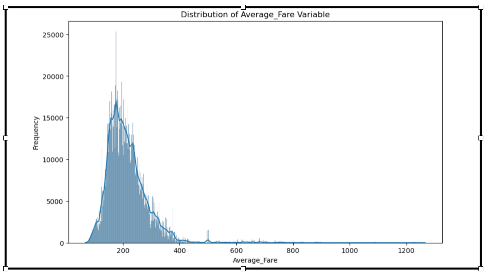
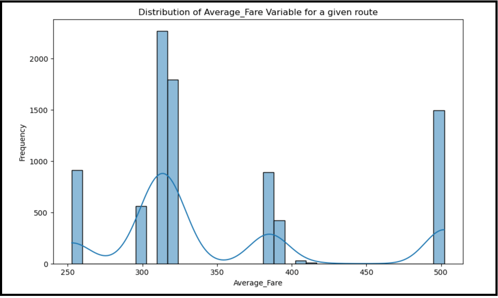

# Data driven prediction of air fare

**Link to notebook** https://github.com/guptakamit040880/M20_Capstone/blob/0854d1458c2b68357edaa6b20b574d3490d4b238/airFare.ipynb
## Problem Statement

Finding the best airfare has been desired by everyone but not always available to all. In this project we will try to predict the best airfare based on historical data.

## Data Understanding

To understand the pattern of air fare, we have a dataset derived from publicly available sources provided by the US Department of Transportation Bureau of Transportation Statistics (BTS). It combines and processes data from two major sources — the DB1B and T-100 datasets. Along with cleaned BTS data, the dataset features additional variables that help explain fare differences across markets, such as competition intensity, circuity and existence of multiple airports within the origin, destination, or both.

## Objectives

Understand the relationship between various features and average airfare. Build and evaluate multiple regression models to predict the best average airfare. Provide actionable insights based on model findings.

## Distribution of Average_Fare Variable

## Limit the data set for a specific route.

## Modeling and performance

Linear Regression: RMSE = 46.6616, R2 = 0.6413\
Ridge Regression: RMSE = 49.0683, R2 = 0.6034\
Lasso Regression: RMSE = 53.0239, R2 = 0.5368\
Elastic Net Regression: RMSE = 57.5196, R2 = 0.4550

**Linear Regression** has the best performance among the four models with the lowest RMSE and the highest R2 value. It is the most suitable model for this dataset based on the given metrics.

**RMSE (Root Mean Squared Error) = 46.6616:** This value indicates the average error in the predictions. In this context, it means that on average, the model's predictions are off by about 46.66 units from the actual values of average fare.

**R2 (R-squared) = 0.6413:** This value indicates that approximately 64.13% of the variance in the target variable (average fare) is explained by the features in the model. While this is a moderate level of explanation, it also indicates that there is still a significant amount of unexplained variance, suggesting room for model improvement.

## Linear Regression Coefficients:

    MktCoupons                 6.964180e+01
    OriginCityMarketID        -4.316576e-09
    DestCityMarketID          -2.008527e-11
    OriginAirportID           -2.824703e+00
    DestAirportID              2.044552e-01
    Carrier                   -5.531027e+00
    NonStopMiles               4.640094e-01
    RoundTrip                 -2.342537e+00
    ODPairID                  -2.842171e-14
    Pax                        0.000000e+00
    CarrierPax                 7.438422e-04
    Market_share               9.646645e-10
    Market_HHI                 9.094947e-13
    LCC_Comp                   0.000000e+00
    Multi_Airport              0.000000e+00
    Circuity                  -3.657918e+01
    Slot                       1.540852e+02
    Non_Stop                   1.551133e+02
    MktMilesFlown             -3.942219e-20
    OriginCityMarketID_freq   -2.448795e-24
    DestCityMarketID_freq     -6.127415e-25
    OriginAirportID_freq      -7.628059e+03
    DestAirportID_freq        -7.300796e+01
    Carrier_freq               1.867578e+03
    ODPairID_freq              1.499095e-25

## Conclusion

Based on above model Non_Stop flight, preferred slot and carrier frequency impacts the average fare. More desirable slot means more fare.
